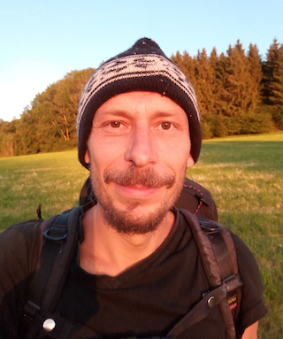

## About me

 
 

### misc147  

* Germany, Munich 
* Languages: C, Perl, C++, German, English
* Good knowledge of Assembler, Shellscripts, SQL, HTML, CSS, Javascript
* Experience: 25 years of software development,  
  running a software company for several years, 
  freelancing 
* Native German speaker. Fluent in English. 

---

 

Specializations

* Linux
* System programming (C, Assembly)
* Resource usage optimization
* Optimization of algorithms
* Web-backends / data processing (Perl,modperl)

Experience

* User interface development (wxwidgets,Qt)
* Databases, database interfaces, data structuring
* System integration and administration
* Analyzing customer demands, consulting
* Conception and design of projects
* Security with C
* AI (therefore python)
* Teaching (at a school)
* Social work

Strengths

* Analyzation and communication of requirements
* Lateral thinking
* MA in Philosophy, focuses amongst others on knowledge conceptions, formalizations and modal logic
* Interested to get into new concepts
* Analytic thinking
* Usability focused
* Creativity
* Open minded
* Reliable
* Experience with social work
* enthusiastic

Weaknesses

* Resentments towards Java and Microsoft 
* enthusiastic
* sometimes missed my work-life balance

---

Other things

<pre>
	Magister Artium (Master of Arts) in Philosophy,
	minors in History of Physical Science and Technics and
	History of Science and Universities.
	Academic studies in Psychology, Sinology, Science of Religion, Archaeology, History, Sociology.
	Journeyman Automotive Technician.
	
	Several opensource software projects,
	electronics ( development and building of audio equipment ),
	art and design, photography,
	music, music production,
	playing guitar,
	hiking, travelling, freeclimbing,
	reading books, Philosophy,
	chess. Interested in politics.
</pre>

