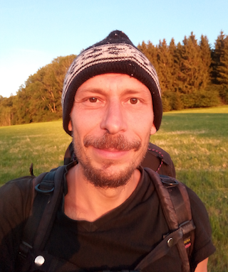

## About me

 
 

### Michael (misc) Myer 

* Age: 40     
* Living in Germany, Munich 
* Languages: Perl, C, C++; Assembler, Shell,  
  SQL, HTML, CSS, Javascript, Ajax, Java 
* Experience: 30 years of development,  
  running a software company for several years, 
  freelancing 
* Native German speaker. Fluent English. 

---
 

### Specializations 

* System programming 
* Perl for web-backends / universal data processing 
* Analyzing and consulting customer demands 
* Conception and design of medium to big sized projects
* Security 

### Strengths

* Analyzation and communication of requirements
* Not limited to informatics with a MA in Pilosophy, focuses amongst others on knowledge conceptions, formalizations, modal logic, logic and actuality
* Experience in teaching
* Analytic thinking
* Usability studies
* Creativity
* Open minded
* Reliable

### Weaknesses

* Won't accept assignments > 80 hours
* Hates Java

### Further interests and hobbies

Several software projects, 
electronics ( especially development and building of audio equipment ), 
art and design, photography, 
music, music production, 
playing the guitar, 
trekking, travelling,  
reading books, Chess.

